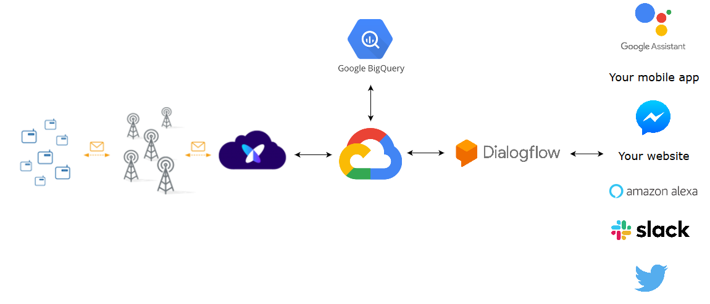

# Accessing Sigfox data through Dialogflow

## Introduction

Since February 2019, Google Cloud Platform can be officialy integrated with Sigfox Backend. Basically, it means that it is now possible to push the data generated from Sigfox enabled devices up to Google Cloud Platform. 

This article presents how to leverage on this integration by giving users new ways to interact with this data such as voice apps and chatbots, powered by AI. This, on several and heterogenous platforms like your own website, mobile app, the Google Assistant, Amazon Alexa, Facebook Messenger, and many others..

Here the goal is show how the data measured by a [Sens'it](https://build.sigfox.com/sensit-for-developers) can be exposed via DialogFlow.



Regarding the previous integration, you can check the related tutorials: [Integrating Sigfox IoT network with Google Cloud Platform](https://cloud.google.com/community/tutorials/sigfox-gw) and [Using Sigfox Sens'it with GCP](https://cloud.google.com/community/tutorials/sigfox-sensit).

## DialogFlow Implementation

DialogFlow is a Google-owned interface of human–computer interaction that allow you to recognize sentences sent by the user and select appropriate *actions* based on configuration and machine learning. 

### Sigfox Agent

In Dialogflow, the basic stream of a conversation involves these steps:

    - The user gives inputs
    - Your Dialogflow agent parses that input
    - Your agent returns a response to the user

To define how conversations work, you create **intents** within your agent that map user inputs to responses.
When defining a new agent, you will get by default the **Default Welcome intent** and the **Default Fallback Intent**.

So, we need to create the **Sigfox Intent** that will handle requests about Sigfox.

### Sigfox Intent Configuration

Intent configuration is well explained in many articles. Feel free to check these out for instance [here](https://medium.com/swlh/chapter-8-how-to-build-a-google-home-app-with-dialogflow-environment-setup-3547993e99a4).
In my example, I have configured the Sigfox intent to ask the user to chose a data type between *temperature* and *humidity*. This parameter will be used then to filter the answer.

### Fulfillment

Google allows to write code that will be triggered at a certain moment during the Intent processing. This is called **Fulfillment**. Here below is an overview of how it works:

That said, it means that the last thing we have to do is to write the portion of code that will ask the data to Google Big Query, filter it and finally deliver it to our Sigfox Intent.

#### Constants definition

Like in every project, you need to define constants. Here they are:

```javascript
'use strict';

const functions = require('firebase-functions');
const { WebhookClient } = require('dialogflow-fulfillment');
const BIGQUERY = require('@google-cloud/bigquery');
const SIGFOX_INTENT = 'Sigfox Intent';
const DATA_TYPE_ENTITY = 'DataType';
const BIGQUERY_CLIENT = new BIGQUERY();

process.env.DEBUG = 'dialogflow:debug';
```

#### Implement the function that will query GCP

1. The fulfillment will query BigQuery database and select the last line based on the [*Sequence Number*](https://support.sigfox.com/docs/sequence-number:-general-knowledge).
Make sure to fill in the query parameters with your Google Cloud Platform information.

2. Depending on which data type has been chosen by the user, fulffilment will filter the corresponding field (ie temperature or humidity).

3. The fulffilment will deliver the answer to the Sigfox Intent.

```javascript
function getDataFromBigQuery(agent) {
        const OPTIONS = {
            query: 'SELECT * FROM `[your_google_cloud_platform_project_name].[your_pubsub_topic_name].[your_table_name]` ORDER BY seqNumber DESC LIMIT 1',
            timeoutMs: 10000,
            useLegacySql: false
        };
        return BIGQUERY_CLIENT.query(OPTIONS).then(results => {
            console.log(JSON.stringify(results[0]));
            const ROWS = results[0];
            const data_type = agent.parameters[DATA_TYPE_ENTITY].toLowerCase();
            if (data_type == "temperature") {
                const temperatureResult = JSON.stringify(ROWS[0].temperature);
                agent.add('The latest measured temperature is ' + temperatureResult + '°C.');
            } else if (data_type == "humidity") {
                const humidityResult = JSON.stringify(ROWS[0].humidity);
                agent.add('The latest measured humidity is ' + humidityResult + '%.');
            } else {
                agent.add("Sorry I did not understand your request.");
            }
          	agent.add(" Would you like to know anything else ?");
        })
            .catch(err => {
                console.error('ERROR:', err);
            });
    }
```

#### Implement fulfillment base block

This is the base block implemented to map the Sigfox Intent and the method triggering.  

```javascript
exports.dialogflowFirebaseFulfillment = functions.https.onRequest((request, response) => {
    const agent = new WebhookClient({ request, response });
    let intentMap = new Map();
    intentMap.set(SIGFOX_INTENT, getDataFromBigQuery);
    agent.handleRequest(intentMap);
});
```


